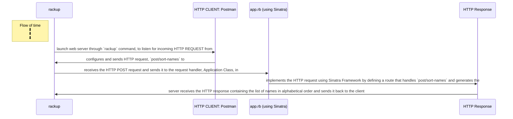

# WEB_APPLICATIONS: HELLO-WEB-PROJECT

----

## Introduction

>a Web browser is a **Client**, which sends HTTP requests and recieves HTTP responses, that response is then displayed to the user.
>a **Server** is the "central" machine where the program runs(alongside usually a database software).
>for Web **Clients and Servers** to communicate through the network, they use a special language called the **HTTP protocol**.
>Client sends an HTTP requests, whilst the Server will handle the request and sends back a HTTP response.
>
>**HTTP REQUEST** is defined by: method(or verb), path(is all that follows the first `/` of a URL), and parameters(or request data).
>**HTTP RESPONSE** is defined by: status code(indicating the result of the operation) and body(or content).

----

## Objective

* To learn how to build a route to respond to HTTP requests
* To learn how to test-drive a route using RSpec
* To learn how web applications work, I will build a sequence diagram to present how different components interacts with each other.
* To learn to return HTML responses to be viewed in a web browser

----

## Sequence diagram for web application: `post/sort-names` route

