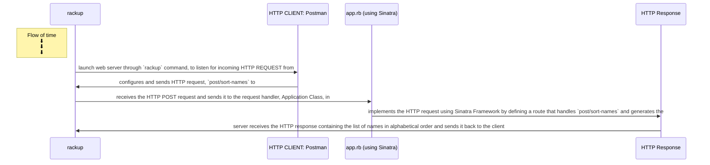

```mermaid
sequenceDiagram
    participant ru as rackup
    participant pm as HTTP CLIENT: Postman
    participant sin as app.rb (using Sinatra)
    participant re as HTTP Response

    Note left of ru: Flow of time <br />⬇ <br /> ⬇ <br /> ⬇ 

    %% t->>app: Runs `ruby app.rb`
    ru->>pm: launch web server through `rackup` command, to listen for incoming HTTP REQUEST from 
    pm->>ru: configures and sends HTTP request, `post/sort-names` to
    ru->>sin: receives the HTTP POST request and sends it to the request handler, Application Class, in
    sin->>re: implements the HTTP request using Sinatra Framework by defining a route that handles `post/sort-names` and generates the
    re->>ru: server receives the HTTP response containing the list of names in alphabetical order and sends it back to the client
```